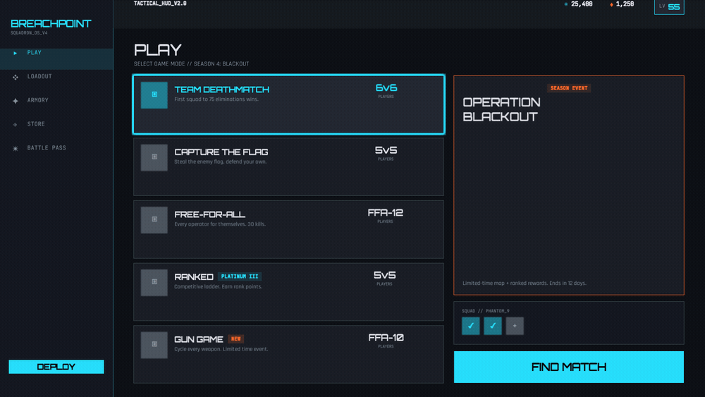
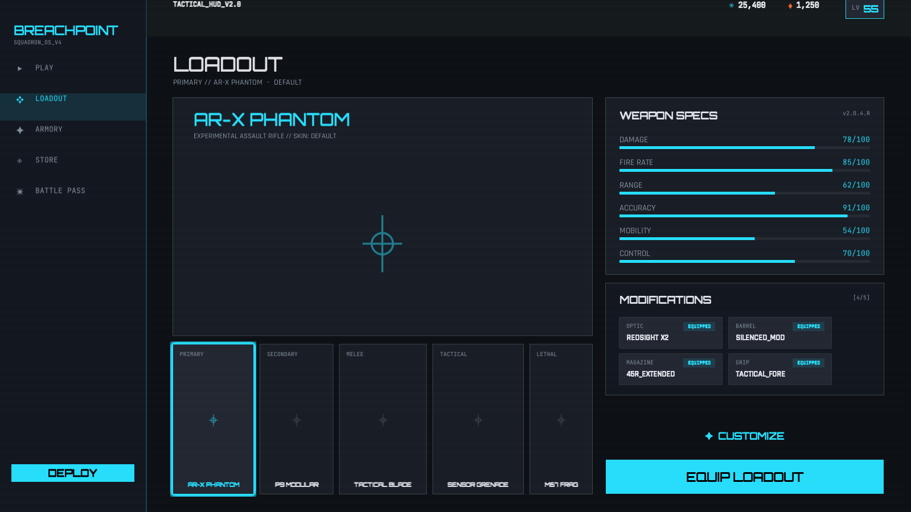
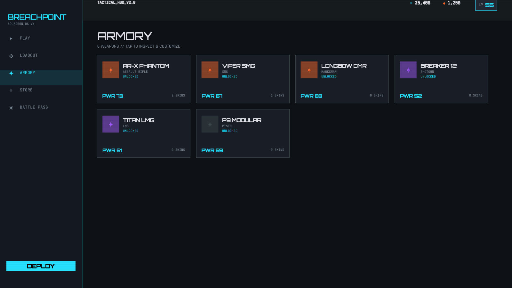
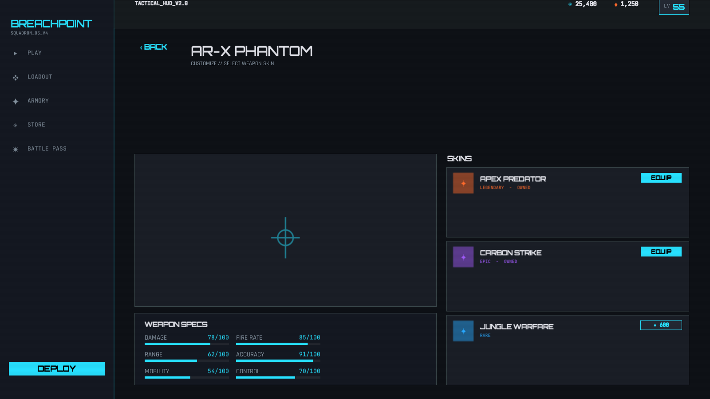
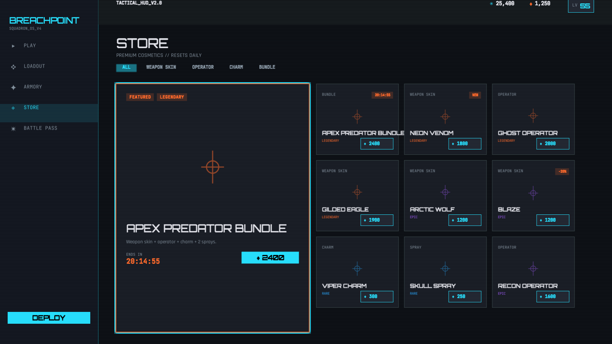
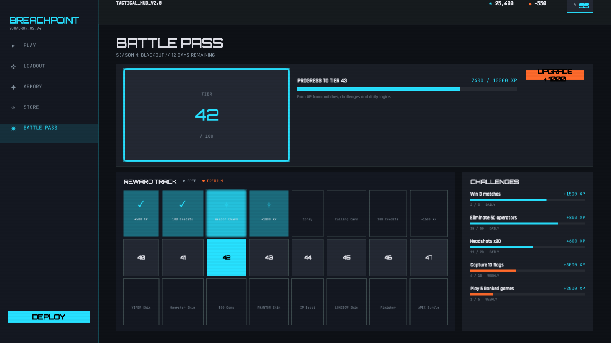
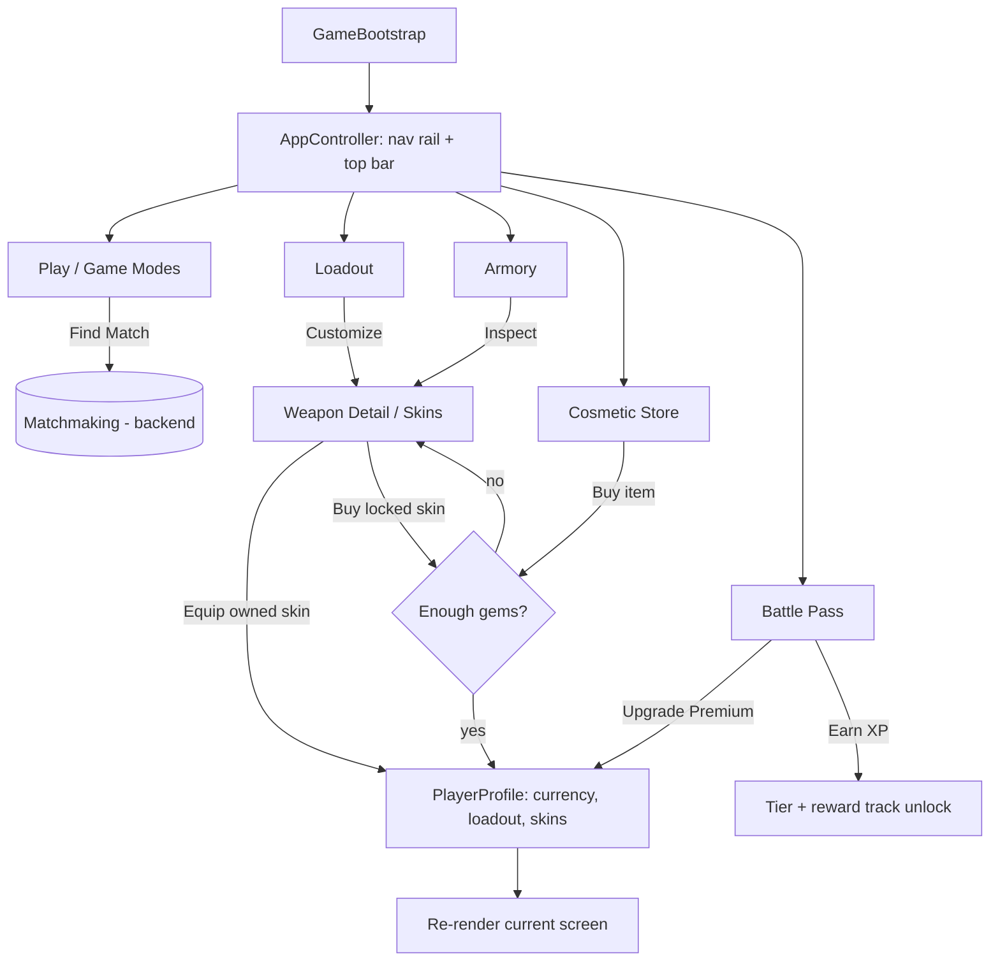

# BREACHPOINT - Unity WebGL FPS: Loadout, Cosmetics & Progression

A **Unity 6 (C#)** front-end vertical slice for a fast-paced **multiplayer browser shooter** (WebGL build),
focused on the live-service feature work that ships in a running FPS: **weapon loadouts and balancing,
weapon skins / cosmetic store, operator & charm cosmetics, game-mode selection, and a battle-pass
progression system**. The entire UI is built in code (uGUI) against a "Neo-Tactical" esports design system,
so it is data-driven, demoable in a browser, and easy to wire to a real backend.



## What it shows

| | |
|---|---|
|  | **Play / Game Modes** - Team Deathmatch, Capture the Flag, Free-for-All, Ranked (rank tier), and a Limited-Time Mode with live tag. Player counts, season banner, squad slots, Find Match. |
|  | **Loadout** - 5 weapon/equipment slots, weapon preview, 6-axis **weapon stats / balancing** bars, attachment modifications, equipped skin. |
|  | **Armory** - full weapon collection with rarity, power rating, unlock level and owned-skin counts. |
|  | **Customize** - per-weapon **skin selector** with rarity tiers, equip owned skins, buy locked skins with premium currency, live stat readout. |
|  | **Cosmetic Store** - featured legendary bundle with countdown, category tabs, 3x3 grid of weapon skins / operators / charms / sprays with rarity color bars and gem pricing. |
|  | **Battle Pass** - Season 4 tier badge, XP-to-next-tier bar, parallel **Free + Premium reward tracks** (claimed / current / locked nodes), Premium upgrade, daily/weekly **challenges** with progress. |

Every screen is interactive: select a mode, equip a skin (currency deducts), buy a store item, unlock the
premium pass - all mutate a single in-memory player profile and the UI re-renders.

## Tech

- **Unity 6000.4 (Unity 6)**, **C#**, **WebGL** build target.
- **uGUI** UI assembled entirely in code (no scene wiring) - one construction path runs in the WebGL
  runtime and in the headless screenshot harness, so captures always match the shipped build.
- A small **router / state machine** (`AppController`) swaps screens under a persistent shell (nav rail + top bar).
- **ScriptableObject-free mock data layer** (`MockDatabase`) drives weapons, stats, skins, modes, battle-pass
  tiers and challenges - swap it for live service calls without touching the views.
- Design-first: screens were designed in **Google Stitch** (see `design/`) and the Unity UI matches that
  design system - charcoal surface, electric-cyan + hot-orange accents, Orbitron / Rajdhani / JetBrains Mono.

## Architecture

```
Assets/Scripts/
  Data/    GameData.cs        enums + models (Weapon, Skin, StoreItem, GameMode, BattlePassTier, ...)
           MockDatabase.cs    static, deterministic content + mutable PlayerProfile
  UI/      Theme.cs           design tokens (palette, fonts, rarity ramp)
           UIFactory.cs       uGUI builder helpers (cards, labels, stat bars, buttons, layout)
           ScreenUtil.cs      shared screen scaffolding
           *Screen.cs         PlayMenu / Loadout / Armory / Store / BattlePass / WeaponDetail
  App/     AppController.cs   shell (nav rail + top bar) + screen router
           GameBootstrap.cs   runtime entry: builds camera + canvas + app
  Editor/  CaptureRunner.cs   headless camera -> RenderTexture -> PNG screenshot harness
           BuildScript.cs     scene creation + WebGL build
```

### Feature flow



## Run

```sh
# Open the project in Unity 6000.4 (Unity Hub), then File > Build Settings > WebGL > Build,
# or from the command line:
Unity -batchmode -quit -projectPath . \
  -executeMethod Breachpoint.EditorTools.BuildScript.BuildWebGL -logFile -
# Serve the WebGLBuild/ output over http and open in a browser.
```

In the editor, just press Play - `GameBootstrap` builds the whole UI at runtime.
